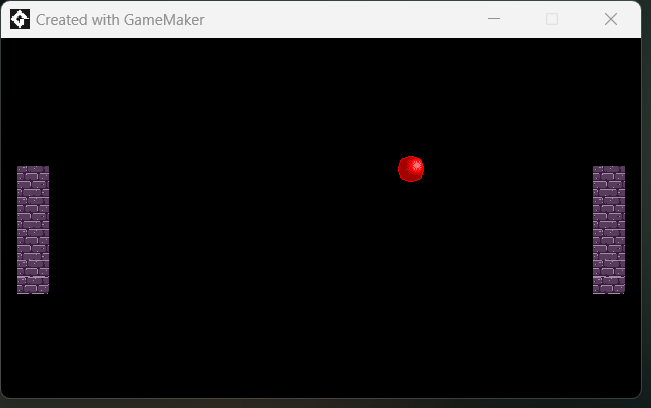

# Simple pong game
Result of fun afternoon learning session working with Game Maker Studio 2

Controls:

- Player 1 -> "W" for up, "S" for down
- Player 2 -> "Arrow UP" for up, "Arrow DOWN" for down

### Game Maker Studio 2 Required to run
[Game Maker Studio](https://gamemaker.io/en/download)
